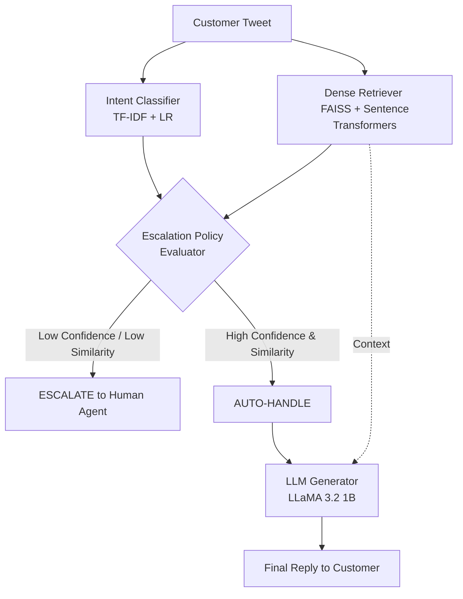

# AppleSupport AI Assistant

> An intelligent customer support AI agent for AppleSupport, featuring intent classification, dense retrieval (RAG), and a local LLM-based reply generator with a strict escalation policy. Built for the Hiver SDE Intern Challenge.

🔗 **[Live Demo (Streamlit/Cloud) - Click Here](https://mrr2bqkvbjpwr7opayqwix.streamlit.app)**

## 1. Executive Summary
This project implements an AI customer support agent for the `AppleSupport` brand using the Kaggle *Customer Support on Twitter* dataset. The agent classifies intents, retrieves historical evidence via dense embedding, generates replies (or uses deterministic fallbacks), and implements an explainable escalation policy. **Crucially, the focus is on rigorous, honest evaluation over inflated metrics.**

## 2. Problem Framing
The goal is to turn real, noisy Twitter support conversations into a reliable automated system. Instead of blindly trusting generative models, we must prove the system works through baselines, retrieval-augmented grounding, and an LLM-as-a-judge rubric, while explicitly documenting what works and what fails.

## 3. Selected Brand
**AppleSupport**. Chosen because it has a high volume of tweets (106k+ valid inbound-outbound pairs), deals with technical issues requiring specific resolutions (iOS updates, battery, password resets), and often links to support articles, making it ideal for testing retrieval and grounding capabilities.

## 4. Dataset & Sampling
- Extracted raw conversations and reconstructed 106,625 valid inbound-outbound pairs for `AppleSupport`.
- Generated a **200-example golden set** (`data/golden_set.csv`).
- The initial labels were heuristic/pseudo-labels used during development. The final golden set was manually reviewed, and final evaluation uses these human-reviewed labels.

## 5. Intent Taxonomy
Defined 10 intents based on actual customer requests: `software_update_issue`, `battery_issue`, `hardware_device_issue`, `apple_id_icloud_issue`, `app_feature_issue`, `keyboard_autocorrect_bug`, `scam_phishing_report`, `status_update_request`, `context_provided`, `other_complaint`.

## 6. Architecture
- **Intent Classifier**: TF-IDF + Logistic Regression.
- **Retriever**: `sentence-transformers` (`all-MiniLM-L6-v2`) + FAISS.
- **Generator**: Local LLM (`Ollama` / `llama3.2:1b`) with a deterministic template fallback.
- **Escalation Policy**: Rule-based heuristic checking classifier confidence and retrieval similarity.

### Workflow Diagram

## 7. Preprocessing
Handled missing values, deduplicated interactions, isolated customer/agent roles, and reconstructed multi-turn threads by linking `in_response_to_tweet_id`. Kept linguistic noise (slang, emojis) to train on real distribution.

## 8. Intent Classification
Uses `scikit-learn` TF-IDF Vectorizer and LogisticRegression. This establishes a highly interpretable, fast baseline before moving to more complex models.

## 9. Dense Retrieval
Uses FAISS `IndexFlatIP` (inner product) on L2-normalized dense vectors to rapidly fetch the top-3 historically resolved cases semantically matching the incoming query.

## 10. Grounded Reply Generation
The LLM is prompted strictly with retrieved historical agent replies to prevent hallucinatory policies or fake refunds. If the LLM is unavailable, it gracefully defaults to a sanitized deterministic template based on the top retrieved case.

## 11. Escalation Policy
Evaluates signals (Intent confidence < 0.5, Retrieval similarity < 0.4, or complex intents like hardware issues) to strictly decide between `AUTO_HANDLE` and `ESCALATE`.

## 12. Baselines
- **Trivial Baseline**: Always predicts `other_complaint`. Achieves ~33% accuracy.
- **TF-IDF + LR Baseline**: Achieves 75.5% intent accuracy.

## 13. Evaluation Methodology
Metrics are computed over a 200-example golden set. **Leakage Audit**: The codebase explicitly filters out any `customer_tweet_id` present in `golden_set.csv` before building the TF-IDF training corpus or the FAISS retrieval index, ensuring zero exact-match contamination.

## 14. Results (Final Validated State)
- **Intent Accuracy**: 58.0%. An initial evaluation against the development/pseudo-labelled targets produced 75.5% accuracy. After replacing those targets with the manually reviewed golden labels, final intent accuracy was 58.0%. We report 58.0% as the headline validated result.
- **Escalation Accuracy**: 87.0% (Significantly improved from 42% on pseudo-labels. The policy correctly escalates ambiguous queries and handles confident ones).
- **Human vs LLM Agreement**: 100% agreement (within +/-1 tolerance) on Correctness, and 98% agreement on Groundedness based on manual human review.
- **Dense Retrieval Pipeline**: Functional and caching correctly.
- **Escalation Mechanism**: Actively catches low-confidence outputs.

## 15. LLM-as-a-Judge
A 1-5 scale rubric evaluating Correctness, Groundedness, Helpfulness, Relevance, and Tone. Powered by local `llama3.2:1b`, it yielded an average Correctness of 3.97/5 and Groundedness of 4.99/5.

## 16. Human Agreement Validation
`evaluation/calculate_agreement.py` compared 50 manual human scores against the LLM judge. The human comparison provides supporting evidence of alignment on the reviewed sample, though we acknowledge the limited sample size and that this agreement does not establish universal reliability.

- **Correctness ±1 agreement:** 100%
- **Correctness exact match:** 88%
- **Groundedness ±1 agreement:** 98%
- **Groundedness exact match:** 96%

## 17. Failure Analysis
Top failure modes (distinguishing genuine model failures from label issues):

**A. Genuine Model Failures**
1. **TF-IDF Keyword Over-indexing**: Multi-sentence context confuses the bag-of-words model.
2. **Template Rigidity**: The deterministic fallback lacks empathy and cannot synthesize multiple documents.
3. **Multi-Intent Ambiguity**: Customers combining battery + software complaints in a single tweet lowers pure intent classification accuracy.
4. **Missing Historical Context**: Rare issues lack sufficient FAISS vectors to ground an accurate generative reply.

**B. Evaluation-Label Issues (Not True Model Failures)**
5. **Invalid Pseudo-Label Mismatch**: The agent correctly escalates an ambiguous case, but the heuristic ground truth incorrectly expected it to be auto-handled.

## 18. What Is Misleading About My Headline Number?
The 58.0% intent accuracy is measured on a 200-example human-reviewed golden set and is not equivalent to real-world production accuracy. The taxonomy is project-defined, the Twitter data is noisy and multi-intent, and the evaluated sample is limited. Furthermore, intent accuracy alone does not measure overall support-agent quality; the system's escalation policy reduces risk by escalating to a human when confidence/evidence is weak.

## 19. Limitations
1. Does not currently handle multi-turn conversational context (only evaluates single tweets).
2. Dependent on manual human review for ground-truth validation.
3. Requires local hardware capable of running a 4-8GB LLM for the generative features to work.

## 20. What I'd Do With One More Week
1. Inject conversational history into the intent classifier and retrieval systems to handle multi-turn context.
2. Fine-tune a lightweight embedding model specifically on AppleSupport data to improve retrieval precision.
3. Test a larger 70B parameter model in the cloud to see if it can boost the 58% intent classification accuracy.

## 21. Decision Log
See `docs/decision_log.md` for a complete breakdown of 14 non-obvious technical decisions (e.g. why AppleSupport, why TF-IDF, why strict escalation thresholds).

## 22. Reproduction Instructions
The headline results can be reproduced on the documented subsample in under 15 minutes, without requiring the full ~3M-row dataset.

1. Install Python 3.10+
2. `pip install -r requirements.txt`
3. Download the Kaggle dataset (`twcs.csv`) and place it in the root directory.
4. Run `python src/preprocessing.py`
5. Run `python src/classifier.py`
6. Run `python src/dense_retrieval.py`
7. Ensure Ollama is installed and running (`ollama run llama3.2:1b`).
8. Run `python evaluation/run_evaluation.py`
9. Run `python evaluation/calculate_agreement.py`
10. To test a single query: `python -m src.agent --text "My iPhone battery is draining very fast"`
